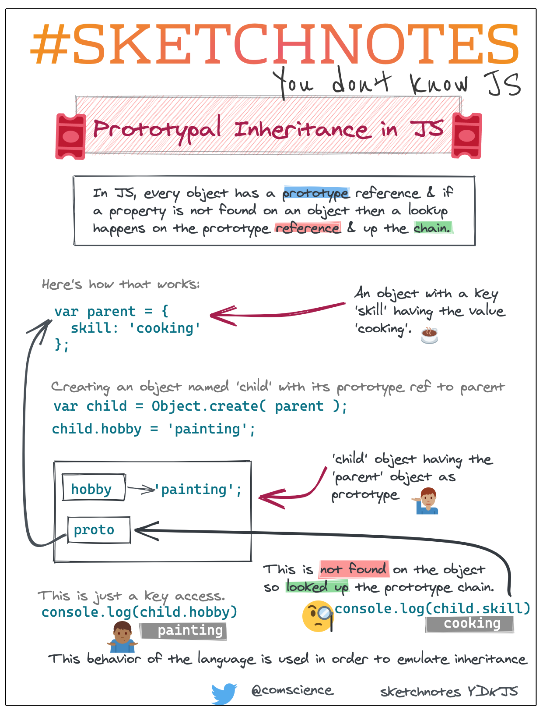

# Resources

* [Introducing Javascript Objects](https://developer.mozilla.org/en-US/docs/Learn/JavaScript/Objects)
* [Javascript Classes — Under The Hood](https://medium.com/tech-tajawal/javascript-classes-under-the-hood-6b26d2667677)
* [Master the JavaScript Interview: What’s the Difference Between Class & Prototypal Inheritance?](https://medium.com/javascript-scene/master-the-javascript-interview-what-s-the-difference-between-class-prototypal-inheritance-e4cd0a7562e9)
* [Making asynchronous programming easier with async and await](https://developer.mozilla.org/en-US/docs/Learn/JavaScript/Asynchronous/Async_await)

## Prototypes vs Class

