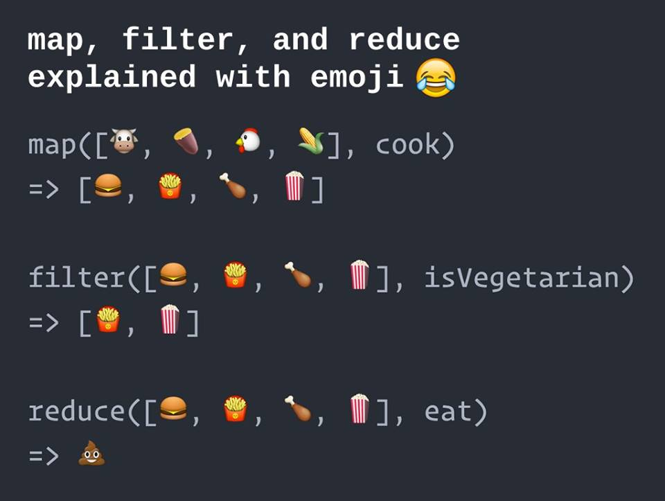

# Week 11 - Day 2

## Learning Portal

* [Introduction to Redux](https://learn.digitalcrafts.com/immersive/lessons/full-stack-frameworks/intro-to-redux/#overview)
* [State, Actions, and Reducers](https://learn.digitalcrafts.com/immersive/lessons/full-stack-frameworks/state-actions-reducers/#learning-objectives)

## Presentations

* [Redux Rising](https://docs.google.com/presentation/d/1AnNW67vUXzmaEdlmcOusEIuEDRJTkXhJ8UqFOTmIkx4/edit?usp=sharing)

## Videos

* [Introduction to Redux](https://learn.digitalcrafts.com/immersive/lessons/full-stack-frameworks/intro-to-redux/#introduction-to-redux-2)

## Recommended Reading

* [MVC vs Flux vs Redux – The Real Differences](https://www.clariontech.com/blog/mvc-vs-flux-vs-redux-the-real-differences)
* [Flux vs. MVC (Design Patterns)](https://medium.com/hacking-and-gonzo/flux-vs-mvc-design-patterns-57b28c0f71b7)

---

## Map, Filter, Reduce, with EMOJI

## Map, Filter, Reduce, with FRUIT

---

## Redux, Explained

