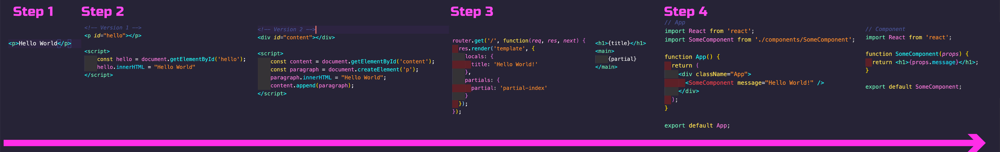

# Week 12 - Day 1

## Where we've been

* Using `create-react-app`
* Elements
* Components and Props
* State and Lifecycle
* JSX
* React Dev Tools
* Events
* Lists and Keys

## Where we are going

* Forms
* React Ecosystem (React Router)
* React + Redux
* Hooks
* Context API
* Styled Components
* React Design Patterns
* Test Driven Development (TDD)

## Our web development journey so far

