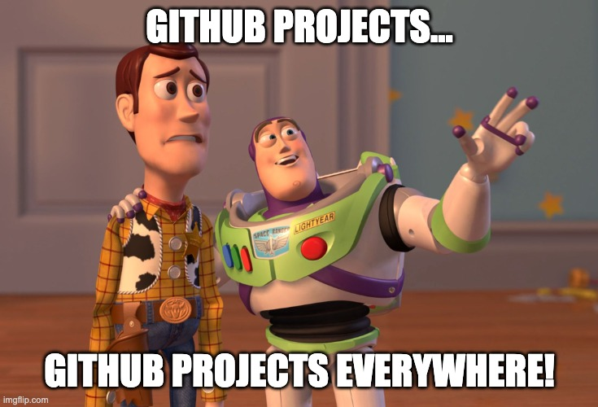

# Week 12 - Day 3

## Where we've been

* Using `create-react-app`
* Elements
* Components and Props
* State and Lifecycle
* JSX
* React Dev Tools
* Events
* Lists and Keys
* Forms
* React Ecosystem (React Router)
* Hooks
* Redux
* React Design Patterns (see today's [Resources](./RESOURCES.md) section!)

## Today we will focus on

... and some **Show'n'Go** (it's like "Show and Tell," but after I _SHOW_ you how something works, you _GO_ and try it out.)
