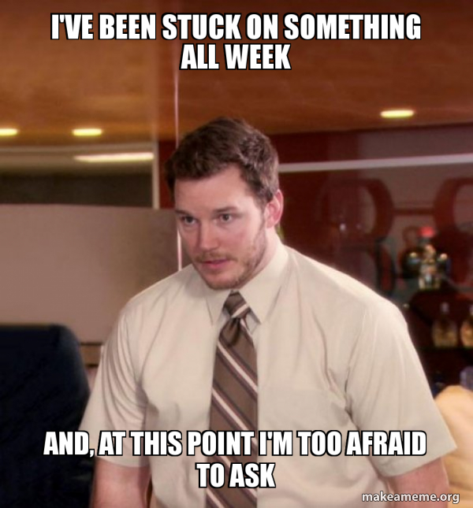

# Week 12 - Day 4

## Where we've been

* Using `create-react-app`
* Elements
* Components and Props
* State and Lifecycle
* JSX
* React Dev Tools
* Events
* Lists and Keys
* Forms
* React Ecosystem
  * React Router
* Hooks (kinda...)
* Redux
* React Design Patterns

## Today we will focus on

* [Styled Components](https://styled-components.com/docs/basics)

## But first

### Recommended Reading

* [A 5-minute Intro to Styled Components](https://www.freecodecamp.org/news/a-5-minute-intro-to-styled-components-41f40eb7cd55/) A little dated, but still pretty solid as an introduction.
* [Flavio Copes: _Styled Components_](https://flaviocopes.com/styled-components/)
* [The styled-components Happy Path](https://www.joshwcomeau.com/css/styled-components/)