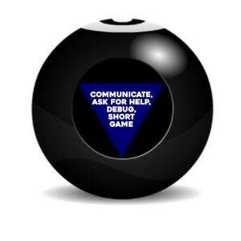

# Week 12 - Day 5

## First, a Quiz!

[React Quiz](https://docs.google.com/forms/d/e/1FAIpQLSerY_xocBAM07uNxqOTkwOdqXjb1peom4Q8rdHYZvncb0P5tw/viewform?usp=sf_link)

## Magic Eight Ball v1

Build a React app that takes user input and consults the Magic Eight Ball API: [https://8ball.delegator.com/](https://8ball.delegator.com/)

### Requirements

#### Choose Your Own Adventure!! (_we're really mashing up the references here.._.)

* Stateful Components, or Functional?
* Styled Components, Framework, or plain CSS?
* Display a list of all questions and their corresponding answers?

#### Items being forced upon you by the Seanarchy™

* Accept user input in the form of a question (**HINT**: Controlled Inputs!).
* Returns the response from Magic Eight Ball.
* Make the answer _look like the Magic Eight Ball image_.
* Prepare to demo by 4:30 PM EST

### BONUS

* Add CSS Animations to "shake" the ball when a question is asked (**HINT**: Maybe via a `className` change?)

### Perpetual Bonus

* Add the Konami Code: [https://github.com/snaptortoise/konami-js](https://github.com/snaptortoise/konami-js)
