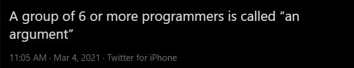

# Week 13 - Redux Returns!

## But first

## Sean's "A Ha!" Moment

> Redux is an introduction into Functional Programming. It takes _all_ `state` objects and makes them into `props`, so your components can be "dumb."

## Learning Portal

### Review

* [Introduction to Redux](https://learn.digitalcrafts.com/immersive/lessons/full-stack-frameworks/intro-to-redux/)
* [State, Actions, and Reducers](https://learn.digitalcrafts.com/immersive/lessons/full-stack-frameworks/state-actions-reducers/)
* [Multiple Reducers](https://learn.digitalcrafts.com/immersive/lessons/full-stack-frameworks/multiple-reducers/)

### New

* [Integrating Redux with React](https://learn.digitalcrafts.com/immersive/lessons/full-stack-frameworks/react-redux-intro/)

## Recommended Reading

* [A Complete React Redux Tutorial for Beginners (2019)](https://daveceddia.com/redux-tutorial/)

## Extra Practice

* [React Redux Basic Tutorial](https://react-redux.js.org/introduction/basic-tutorial)